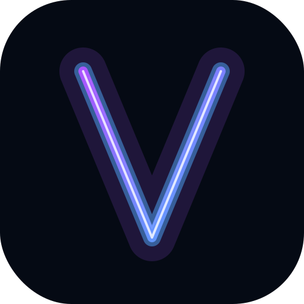

<div align="center">
  
  <h1>VibeSync</h1>
  <p><strong>Watch Together, In Perfect Sync.</strong></p>
  <p>Zero-latency watch parties with E2EE live chat, WebRTC voice calls, direct live streaming, and synchronized playback across videos, YouTube, and Netflix/Prime (via extension).</p>

  [](https://nodejs.org/)
  [](https://react.dev/)
  [](https://socket.io/)
  
  [](https://www.mongodb.com/)
</div>

<br/>

## ✨ Key Features

### 🎬 Synced Playback
- **Perfect Sync** — Real-time replication of pause, seek, and play events across all clients.
- **Versatile Sources**:
  - **Local Upload** — MP4/WebM/MKV support with client-side E2EE before upload.
  - **External Links** — Direct support for YouTube and raw video URLs.
  - **⚡ WebRTC Live Stream** — Zero-upload p2p streaming directly from host to peers.
  - **Binge Platforms** — Sync Netflix, Prime, Disney+, and more via the companion Chrome Extension.

### 🔐 Privacy First (E2EE)
- **Zero-Knowledge** — Chat, reactions, and uploaded videos are encrypted (AES-GCM) with keys that never leave your device.
- **PBKDF2 Derivation** — Secure keys derived from the room code (100,000 iterations).
- **Anonymous** — Guest mode allows joining without permanent account creation.

### 🎙️ Real-time Communication
- **P2P Voice Chat** — High-quality full-mesh WebRTC audio channels.
- **Dual-Audio Streaming** — Participants hear both the synced video and the host's commentary.
- **Moderation** — Host-level controls to mute individuals or the whole room.

### 👥 Room Control
- **Access Management** — Public/Private rooms, lobby approvals, and room locking.
- **Ownership** — Easy host transfers and participant management (kick/mute).
- **Social** — BRB status, reply threading, and floating emoji reactions.

---

## 🛠️ Tech Stack

| Layer | Technology |
|-------|------------|
| **Frontend** | React 19, Vite, Tailwind CSS, Lucide Icons |
| **Real-time** | Socket.IO, WebRTC (P2P Mesh) |
| **Backend** | Node.js, Express |
| **Storage** | MongoDB (State/Chat History), Cloudinary (Video Assets) |
| **Security** | Web Crypto API (AES-GCM), PBKDF2, HMAC-SHA256 |
| **Extension** | Chrome Manifest V3, Content Scripts |

---

## 🚀 Getting Started

### Prerequisites
- Node.js v18+
- MongoDB instance (Local or Atlas)
- Cloudinary Account (Optional: for cloud video uploads)

### 1. Backend Setup
```bash
cd backend
npm install
```
Configure `backend/.env`:
```env
PORT=5000
MONGO_URI=your_mongodb_uri
JWT_SECRET=your_jwt_secret
HASH_SECRET=your_hash_secret
FRONTEND_URL=http://localhost:5173
# Cloudinary (Optional)
CLOUDINARY_CLOUD_NAME=...
CLOUDINARY_API_KEY=...
CLOUDINARY_API_SECRET=...
```
`npm run dev`

### 2. Frontend Setup
```bash
cd frontend
npm install
npm run dev
```
Open `http://localhost:5173`.

### 🐳 Docker
```bash
docker-compose up --build
```

---

## 🎮 Usage Guide

| Role | Primary Actions |
|------|-----------------|
| **Host** | `Create Room` → `Load Video` → `Invite Friends` |
| **Participant** | `Enter Code/URL` → `Join Voice` → `Chat & React` |

<details>
<summary><b>Detailed Host Controls</b></summary>

- **Load Video**: Support for local files (upload or stream), YouTube, or URLs.
- **Moderation**: Toggle "Approval ON" to vet join requests or "Lock Room" to stop new joins.
- **Sync**: Use "Sync via Upload" for cloud hosting or "Stream Instantly" for zero-lag P2P sharing.
- **Transfer**: Hand over room ownership to any participant via the People tab.
</details>

---

## 🧠 Under the Hood

### Room State Management
Live session data is managed via an in-memory `RoomStore` in `backend/src/server.js`. Persistence is handled by MongoDB for chat history (last 100 messages) and room configuration.

### Security Implementation
- **Hashing**: Room codes are protected via HMAC-SHA256 using a server-side `HASH_SECRET`.
- **E2EE Details**: Uses `AES-GCM` (256-bit) with a 12-byte IV per payload. Keys derived via PBKDF2 from room code + unique salt.
- **Zero-Visibility**: The backend only relays encrypted payloads; it cannot decode chat contents or video URLs if E2EE is active.

---

## 🔌 API & Event Reference

<details>
<summary><b>HTTP API (Backend)</b></summary>

- `GET /api/health`: Returns system status and room count.
- `POST /api/auth/guest`: Authenticate as a guest.
- `POST /api/rooms`: Create a new session (Host only).
- `POST /api/upload`: E2EE video upload (Cloudinary).
- `GET /invite/:roomCode`: Server-rendered OpenGraph preview for sharing.
</details>

<details>
<summary><b>Socket.IO Event Reference</b></summary>

- **Lifecycle**: `room:join`, `room:leave`, `room:set-approval`, `room:toggle-lock`.
- **Playback**: `video:play`, `video:pause`, `video:seek`, `video:heartbeat`, `video:sync-duration`.
- **Voice**: `voice:join`, `voice:offer`, `voice:answer`, `voice:ice-candidate`.
- **Chat**: `chat:send`, `chat:reaction`, `chat:typing`, `chat:message-reaction`.
- **Social**: `poll:create`, `poll:vote`, `queue:suggest`, `room:theme:set`.
</details>

<details>
<summary><b>Chrome Extension Sync</b></summary>

- **Base URL**: `/api/ext`
- **Sync**: `POST /api/ext/sync/:roomCode`
- **Supported Platforms**: 
  - Netflix, Amazon Prime Video, Disney+ Hotstar, JioCinema
  - Disney+, Max / HBO Max, SonyLIV, Zee5
  - MX Player, Amazon miniTV
</details>

---

## 🤝 Contributing
PRs are welcome! To extend VibeSync:
1. **Frontend**: Add UI components in `frontend/src/components`.
2. **Backend**: Extend Socket handlers in `backend/src/server.js`.
3. **Extension**: Add platform selectors in `extension/src/content_script.js`.

---
<div align="center">
  Built with ❤️ by the VibeSync Team.
</div>
